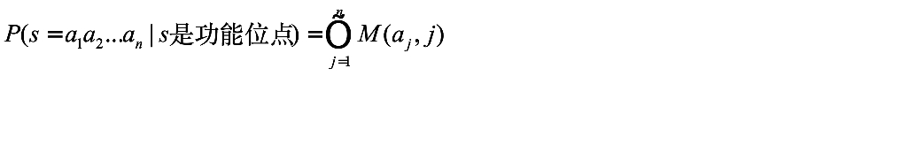
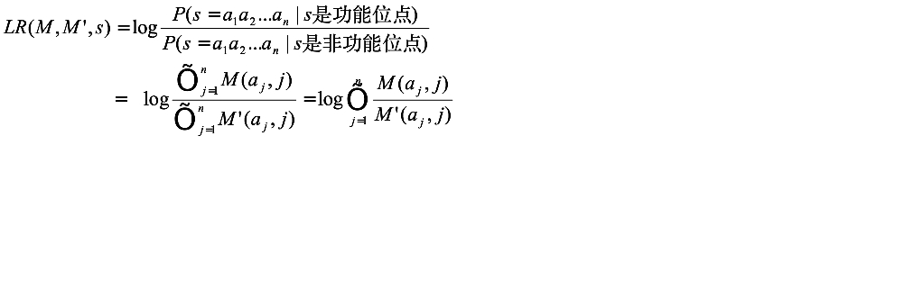
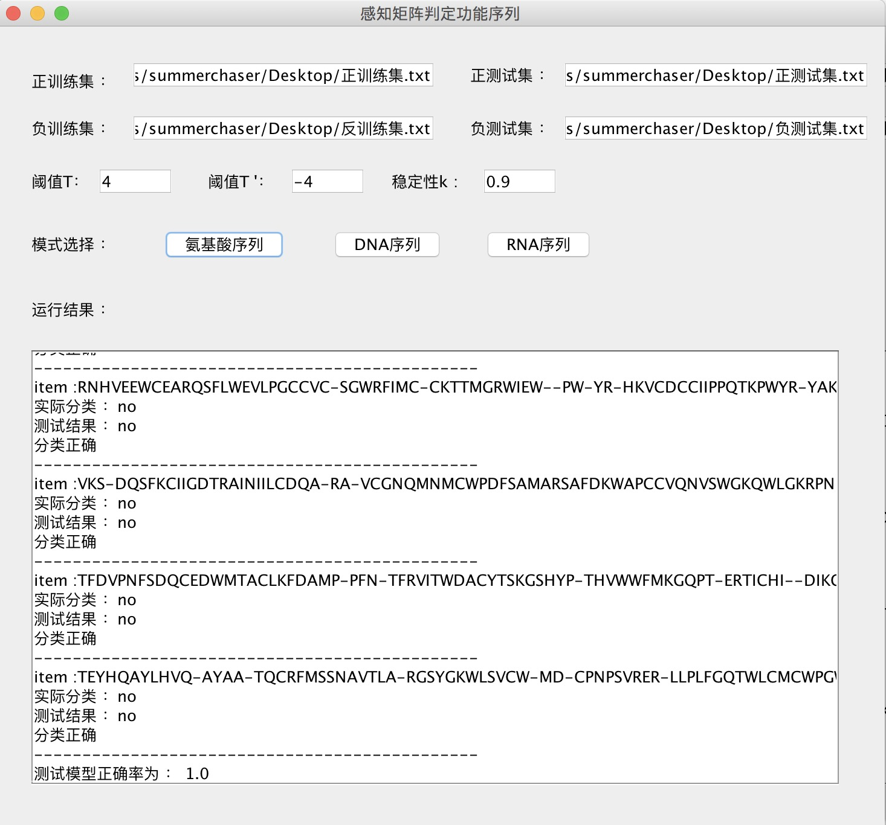
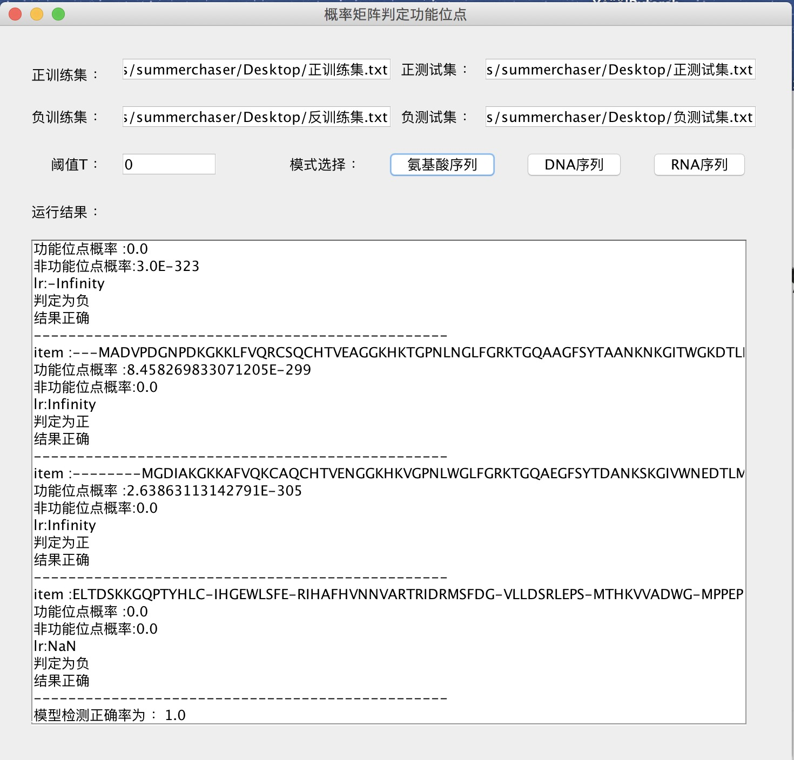

# SenseMatrix
用核苷酸感知矩阵（加权矩阵）与概率矩阵判定功能位点

## 感知矩阵
感知矩阵（或加权矩阵） 
通过训练集构建感知矩阵，用权系数描述功能位点各位置上每种核苷酸的相对重要性   

其大小为4*n        
   4代表碱基的种类数目，n代表功能位点的长度            

矩阵的每一个元素M(a,j)的值代表第a种核苷酸在功能位点第j个位置上出现的得分。   

对于一个序列s=a1a2…an，根据对应位置上核苷酸的类型，取感知矩阵中对应的权值，加和以后得到该序列的得分      
设S=ATTGCA，则
               Ws = 1+6+14-5+8+19=43    
               
T——功能位点阈值       
T’——非功能位点阈值        
如果Ws > T，则S是功能位点；   
如果Ws < T'，则S是非功能位点。     
      
感知矩阵M的构造算法          
令A+代表功能位点集合，A-代表非功能位点集合           
       
过程如下：        
  （1）初始化M为零矩阵       
      
  （2）执行过程（3）-（6）的循环；           
             
  （3）依次取训练集合中的每个实例Si，如果Si∈ A+，转（4）,如果Si∈ A-，转（5）； 
       
  （4）如果W（Si）> T，M不变;否则根据Si的核苷酸分布,将M中所有对应元素的值加1（对于正例，增加对应位置核苷酸的权重）转6；     
           
  （5）如果W（Si）< T’，M不变;否则根据Si的核苷酸分布，将M中所有对应元素的值减1,转6；   
      
  （6）若训练集合中的所有实例都处理过，则循环结束，转(7)，否则继续执行循环体，直到处理完所有实例；     
       
  （7）如果M稳定，则结束；否则转（2）。        
        
上述算法反复调整感知矩阵M的元素值，直到M矩阵能够正确识别训练集中的所有功能位点和非功能位点。   
      
M稳定率：用该感知矩阵分类训练集的正确率。    

### 概率矩阵
      
与感知矩阵类似，如果令矩阵每一个元素M(a,j)的值代表第a种核苷酸在功能位点第j个位置上出现的概率，则M是一个概率矩阵。   
对于给定一个序列s=a1a2…an，   
可以计算出功能位点序列为s的概率：   
 
      
分别统计功能位点和非功能位点核苷酸出现的概率,通过计算可以形成两个矩阵M和M’ 
进一步计算可以判断一个给定的序列属于功能位点，还是属于非功能位点。    
给定一个序列s=a1a2…an，定义似然比LR(M,M’,s)：      
 
     
在进行功能位点检测时       
计算LR(M,M’,s)，并与给定的阈值T比较      
如果LR(M,M’,s)>T，则序列s可能是一个功能位点。   
   
一般阈值取0  

### 软件截图    
      
具体输出结果存放于sense.txt pro.txt文件    

   

